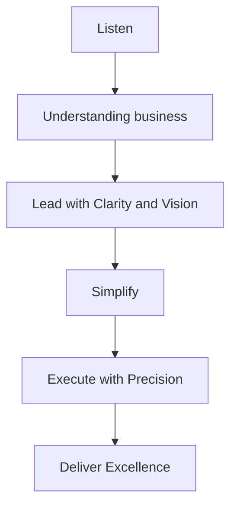

# ✨ Loukas-Nikolaos Vetoulis

<div align="center">

<pre align="center">
```ascii
╔═══════════════════════════════════════════════════════════════╗
║                    S O F T W A R E   E N G I N E E R          ║
║                                                               ║
║              "Simplicity is the ultimate sophistication"     ║
║                            — Steve Jobs                       ║
╚═══════════════════════════════════════════════════════════════╝
```
</pre>
📍 Athens, Greece | 🎯 Available for collaboration

[](mailto:loukasvetoulis@gmail.com)
[](https://www.linkedin.com/in/loukas-vetoulis)
[](https://your-portfolio-url.com)

</div>

---

## 🎭 **The Philosophy**

<table>
<tr>
<td width="60%">

> *"I work with a limited number of clients to ensure each project receives the focus it needs to succeed. Every engagement begins with listening—gaining a deep understanding of your business, your challenges, and your goals. From there, I lead with clarity, simplify where it matters, and execute with precision—delivering solutions that are not only effective but built to last."*

**Core Principles:**
- 🎯 **Clarity** over complexity
- 🛠️ **Maintainability** as foundation
- 📈 **Results** that drive real value

</td>
<td width="40%">



</td>
</tr>
</table>

---

## 🚀 **Current Mission**

<div align="center">

### Software Engineer @ Mellon Group
*Banking Excellence Through Automation*

</div>

<div align="center">

| 🎯 **Impact Area** | 🔧 **Solution** | 📊 **Result** |
|:---:|:---:|:---:|
| **Error Management** | Automated monitoring system | Real-time issue resolution |
| **Data Pipeline** | Python-based log parsing | Streamlined operations |
| **Visualization** | Interactive dashboards | Actionable insights |
| **QA Automation** | Android EFTPOS testing | Enhanced reliability |
</div>

---

## 🎨 **Technology Palette**

<div align="center">

### **Primary Stack**


### **Specialized Tools**


</div>

---

## 🏆 **Selected Projects**

<details>
<summary><b>🧠 LSTM vs Traditional ML Comparison</b></summary>

```yaml
Project: LSTM-ML-Compare
Vision: Advanced neural network analysis
Impact: Breakthrough performance insights
Stack: Python | PyTorch | Scikit-learn
Link: https://github.com/loukas-vetoulis/LSTM-ML-Compare
```
**What makes it special:** Rigorous comparison methodology revealing when complex beats simple.
</details>

<details>
<summary><b>🎮 Performance-Optimized Asteroids Game</b></summary>

```yaml
Project: C-SGG-Asteroids-Arcade  
Vision: Silky-smooth 2D gaming experience
Impact: Zero-lag collision detection
Stack: C++ | SGG Graphics Engine
Link: https://github.com/loukas-vetoulis/C-SGG-Asteroids-Arcade
```
**What makes it special:** Every frame matters—optimized for pure performance.
</details>

<details>
<summary><b>🤖 Full-Stack AI Chatbot</b></summary>

```yaml
Project: AI Chatbot Integration
Vision: Seamless human-AI conversation
Impact: Natural language understanding
Stack: Python | OpenAI API | Full-Stack
Link: https://github.com/loukas-vetoulis/Ai-Chatbot
```
**What makes it special:** Bridge between human intent and machine capability.
</details>

<details>
<summary><b>🎯 Optimized A* Pathfinding</b></summary>

```yaml
Project: A* Algorithm Implementation
Vision: Intelligent navigation solution  
Impact: Optimal path discovery
Stack: Java | Algorithm Design
Link: https://github.com/loukas-vetoulis/AUEB-Ai-Project-Assigment
```
**What makes it special:** Mathematical elegance meets practical efficiency.
</details>

<details>
<summary><b>🌐 Distributed System Architecture</b></summary>

```yaml
Project: FreeFooders
Vision: Scalable distributed computing
Impact: High-availability system design
Stack: Java | Distributed Architecture
Link: https://github.com/loukas-vetoulis/FreeFooders
```
**What makes it special:** Built for scale, designed for resilience.
</details>

---

## 🎓 **Academic Excellence**

<div align="center">

### 🏛️ **Athens University of Economics & Business**
*B.Sc. in Informatics* | 2022 – Present

</div>

<div align="center">

| 🏅 **Achievement** | 📊 **Metric** |
|:---|:---:|
| **Competitive Admission** | Ranked **51st** nationally |
| **Panhellenic Excellence** | **1st place** in Economics & Informatics |
| **Mathematical Recognition** | Multiple **HMS** commendations |
| **Innovation Exposure** | **MIT** Global Startup Workshop 2023 |
</div>
---

## 🌍 **Beyond the Code**
<div align="center">
<table>
<tr>
<td width="50%">

### 🗣️ **Languages**
- 🇬🇷 **Greek** (Native fluency)
- 🇺🇸 **English** (Professional - B2 Certified)

</td>
<td width="50%">
</div>

### 🎯 **Passions**
- 💻 Continuous learning & innovation
- ⚽ Sports & physical excellence  
- 🎬 Cinema & storytelling
- 📚 Literature & knowledge

</td>
</tr>
</table>

---

## 🤝 **Let's Create Something Extraordinary**

<div align="center">

### Ready for clarity in your next project?

*If you value thoughtful, business-driven software that delivers quiet power through elegant simplicity—let's start a conversation.*
<div align="center">

```
🎯 Available for: Custom Software Development
🔧 Specializing in: Automation • AI Integration • System Architecture  
📅 Approach: Listen First • Design Smart • Build Right
```
</div>
**Get in touch:**

[](mailto:loukasvetoulis@gmail.com)
[](mailto:loukasvetoulis@gmail.com)
[](https://www.linkedin.com/in/loukas-vetoulis)

</div>

---

<div align="center">

*"Simplicity crafted through vision and precision."*

**© 2024 Loukas-Nikolaos Vetoulis** 

</div>
